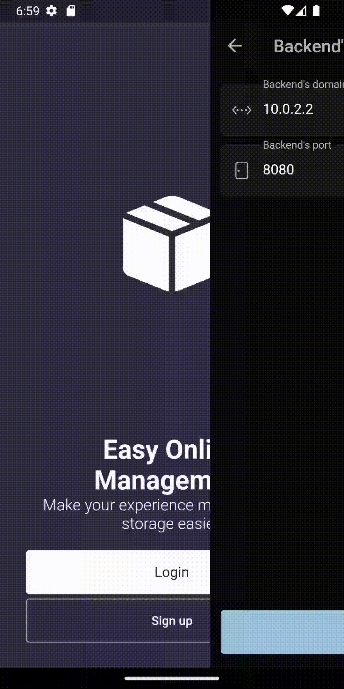

# Entrepoty

Entrepoty is an application designed to help service desk teams organize their company's storage efficiently. The app
offers features like registering items on the stock, recording the borrowing of an item by a user, and other inventory
management functionalities.

The app was built using Flutter and the Getx library for the frontend, while Kotlin and Spring Boot were used for the
backend. The project follows industry best practices such as Design Patterns, Clean Architecture, SOLID, DRY, KISS,
YAGNI, SoC, TDD, DDD, and BDD.

### How it may help you

Entrepoty offers a streamlined solution for managing a company's inventory. With features like item registration,
borrowing record-keeping, and inventory management functionalities, service desk teams can save time and effort while
ensuring the company's inventory is well-managed.

The app's user management functionalities help teams keep track of employee borrowing activities, making it easier to
track down missing items and reducing the likelihood of misplacing inventory.

# App Overview
We've included a few GIFs to provide a brief showcase of the design and features that are available on the application. Please note that the design and layout of the application may change over time, so the GIFs may not represent the latest version or the current layout of the app.

### Configure your backend
Deploying the application is straightforward as it is intended to be self-hosted. To use the application, simply deploy your own backend and configure the application to use it. All that's required is the IP and port number of the backend on which it is running.

Please note that at this time, the project does not provide a valid default backend. Therefore, deploying your own backend is currently the only option available. 

### Change between theme
The application provides a convenient option to switch between light and dark mode themes. This feature offers a range of benefits including improved usability, accessibility, and aesthetics, resulting in an enhanced user experience.

